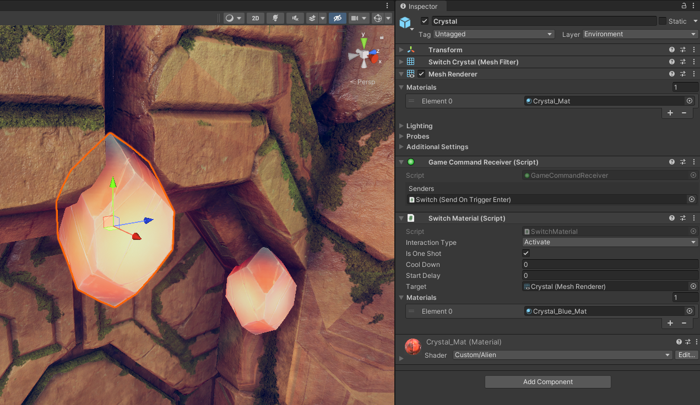
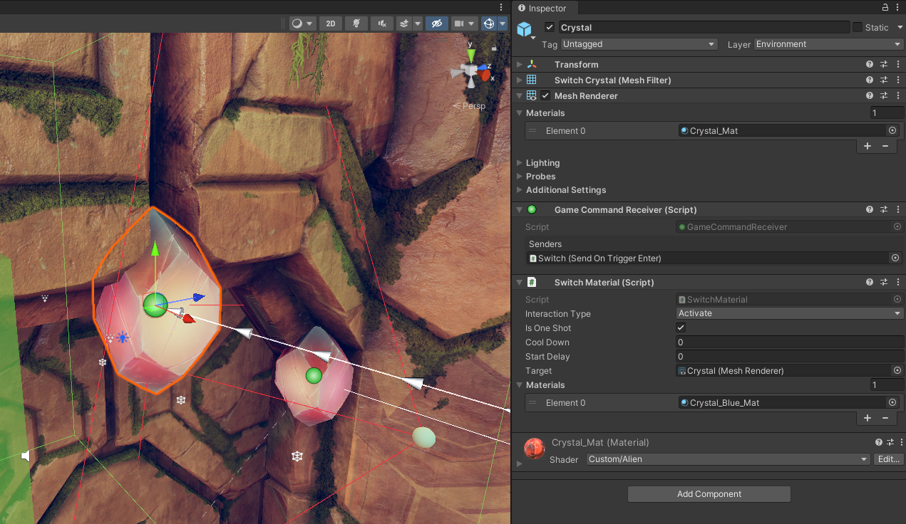

Almost all games need some way to connect actions in the game world with events they cause. The simplest example is pressing a button to open a door.
These connections in some cases can be hardcoded, "*every door needs a button to open*" and this is perfectly fine when we know that this will be true for the whole game.
But we can't always know the scope this precisely, and designers like to experiment to find the best way to interact with the game world.

# The problem

These logical connections need to be editable by as many people as possible. A level designer might want to add a door that needs a key, or a cinematic designer might want to play a complex sequence when the player reaches a segment of the level.
This means that these connections can't be implemented in code for each case. As that would either require a programmer to step in and write each connection, which would make development slow and cause friction between departments.
The other option would be that the designers would need to write the connection code, but this would mean that the designers need to be able to write code. This is rarely the case and would mean that many good designers would need to learn a new discipline.

# Existing solutions

Presumably, all games that have a large world or complex level logic have some system to solve this. Sadly not many companies share these components, and finding talks about them in the GDC Vault is also hard.
There are 2 examples that I could find. From these, we can try to take inspiration. These solutions are at least Source Available and thus we can see how they are implemented.

## Source Engine
Source Engine is made by valve and is a highly battle-tested engine. It is one of the oldest engines but we can learn a lot from it as many of the ideas developed for it are now industry standard.

Source has an Input/Output System, it is a highly robust system for designing world logic. For example, all of Portal's puzzles are made using it. The main strength of it is that after making the basic components the designers can do everything else without much help from the programmers.
This is achieved with full integration with the Hammer world editor, and many smaller logical building blocks.

### I/O system
The [Valve developers wiki](https://developer.valvesoftware.com/wiki/Inputs_and_Outputs) gives a really good overview of how it works, but I will try to summarize it here as well.

Let's start with what is visible from the system to the user. Anything that can move or has any amount of data or logic is called an entity in Source. These are special as they can have more data on them. One of the most basic examples for an entity is a model, as these need the path of the model to draw, and the textures or shaders to use.

A more interesting example of entities are the non-visible ones, like spawners or particle emitters. These are not visible in the game, only in the editor.

All of these entities have an Input-Output tab in the editor

In the Source engine, you can set up connections between entities by connecting one of the entities outputs to another entity's input. These Outputs act as events and they are specific to the type of entity. For example a "trigger region entity" might have an output named ``OnTrigger``, they also have Outputs inherited from their parent classes. Then these Outputs can be mapped to the Inputs on other entities. These Inputs are basically actions they can perform. For example, a fire particle entity might have ``StartFire`` and ``Extinguish``. 

These connections can be easily managed from the editor. The user can set up connections to define a delay to apply to the event, and also send optional parameters.

The interface has a Convenient dropdown to select the output and an object picker to select the targets.

The power of this system comes from the fact that there are many Logical entities that allow the implementation of more complex logic.

### Examples

Some examples of these integrations form Unity and Source:
- **[game_text](https://developer.valvesoftware.com/wiki/Game_text) entity**
This is used for displaying text on the screen like a chapter title.
- **[game_score](https://developer.valvesoftware.com/wiki/Game_score) entity**
This entity can be used to add or subtract a point from a player.
- **[light_spot](https://developer.valvesoftware.com/wiki/Light_spot) entity**
This is a basic spotlight that has Inputs to turn it on ( ``TurnOn`` ) and off ( ``TurnOff`` ) and also to set a patterns to use for flickering the light.
- **[logic_auto](https://developer.valvesoftware.com/wiki/Logic_auto) entity**
This is an entity that can fire Outputs automatically when the game starts up.
For example, it has ``OnMapSpawn``which is fired any time the map is loaded, there are also versions of this output for when the map is loaded from a save or as the start of a new game.
- **[logic_branch](https://developer.valvesoftware.com/wiki/Logic_branch) entity**
This entity holds a single bool value that can be toggled using its inputs (``Toggle`` and ``ToggleTest``) and it has outputs for when it is set to true and false (``OnTrue``, ``OnFalse``)
- **[logic_compare](https://developer.valvesoftware.com/wiki/Logic_compare) entity**
This entity can compare two inputs and fire an Output based on the values received by it.
- **[logic_relay](https://developer.valvesoftware.com/wiki/Logic_relay) entity**
Using this entity it is possible to forward a single event to many other entities.
- **[npc_maker](https://developer.valvesoftware.com/wiki/Npc_maker) entity**
This entity is responsible for spawning NPCs, it has properties to specify the type, squad, and relations, they will have.
There are inputs to stop and start spawning or spawn a single one.

### The internals
Most of the code for this is found in the [cbase.cpp](https://github.com/nillerusr/source-engine/blob/master/game/server/cbase.cpp#L251) file of the source code. After a bit of reading, we can see that it calls the ``g_EventQueue.AddEvent`` to actually send the event. This has a few parameters that, define the name of the Input to call, the name of the target as a string. It also takes in the rest of the things we can configure in the UI, the delay, the optional parameter.

After this, the [EventQueue](https://github.com/ValveSoftware/source-sdk-2013/blob/master/sp/src/game/server/eventqueue.h) puts this into a list sorted by the time the event needs to fire (Current time + delay).
An interesting thing to note is that EventQueue does not fire the event in the same call. The events are actually acted upon at the top of the core game update loop. This is done in the [ServiceEvents](https://github.com/nillerusr/source-engine/blob/master/game/server/cbase.cpp#L901) function.
This approach makes sure that long chains of events can't cause lag.

## Unity

Unity has released an example project that show how a more complex game might be put together in their engine. This project is a small adventure game with localized logic puzzles.

They made an event system that they talk about in the accompanying Unity Learn course. In their scripts they send commands rather than events, this is only a naming difference, they mean the same thing as events.
This event system is a simple one that only has a fixed number of event types ( ``None, Activate, Deactivate, Open, Close, Spawn, Destroy, Start, Stop``). These are only for the purpose of differentiating between the events sent to the same game object.

### Components
#### Sending commands
Sending commands can be done by any script inheriting from `SendGameCommand` . 
This has a ``Send()`` function that other scripts can use to send events. There are many pre-made scripts that inherit from `SendGameCommand`. 
For example, `SendOnCollisionEnter`, `SendOnCollisionExit`, `SendOnCollisionStay` These send a command (event) on the respective collision event. There is also a full set of these for trigger events.
The target of the events is a script called: `Game Command Receiver`.

In the picture above, you can see these components in action. There is a simple box collider and when the player enters (layer filter set to: `player`), it sends an `Activate`  command to the GameObject `Crystal`.

#### Receiving commands
Any GameObject that needs to receive commands (events) needs the `Game Command Receiver` component. This acts as a hub for directing the event to the right Function inside the right component, this is done by having an internal list of which event to send to which component of the GameObject. These are registered in by the component that wants to receive a given event. 
Every script that wants to process commands is inherited from `GameCommandHandler` Witch registers itself in its `Awake` method.
It also gives fields for setting what event to listen to, and to set a cooldown and start timer.

There are many already made scripts that do inherit from `GameCommandHandler`.
These can do a variety of things like:
- `PlaySound` that will play a sound when it get's a command
- `SetGameObjectActive` That will activate and deactivate a set of target game objects.
- `SimpleTranslator` Is a script that can move an object from a start position to and end position with a lot of configurable options. This is for example used for the Big doors in the demo scene ( `DoorHuge` in scene `Level1`  ).

In the above image, we can see the other half of the previous example. This is the target of the switch form before. It has the Command receiver script that  was targeted in the switch. There is also a material switcher component that is set to listen to `Activate` events, it is also set so that is only fires once. When it fires, it will switch out the material, so the gem will glow with blue.

With the gizmos turned back on we can see that the system has a deep editor integration as it shows the connected componets with arrows leading to and from event sources.

# The requirements

For designing a system that solves these logical connections, we need to decide what are the main requirements for it.
At first, these requirements should be high level, to see what are the most important aspects.

A world and gameplay logic system would need to be:
1. Easy to use, eg. set up new connections
2. Generic
3. Fast

## 1. Easy to use
The system needs to be easy to understand and use while developing the game. Any designer and non-programmer need to be able to add new connections to create the game world they envisioned.
This means that the system needs good editor tooling and integration to allow for seamless workflows.
We have seen this in both Unity and Source examples, they both have deep integration with the editor.

## 2. Generic
The system needs to be able to communicate with as many parts of the game and game engine, as possible. This means that the system should be able to interact with almost any part of the game. This for example includes the physics system, the cinematic choreography, inventory, and the quest system.

## 3. Fast
A system with this level of integration and usage needs to be fast. This is 