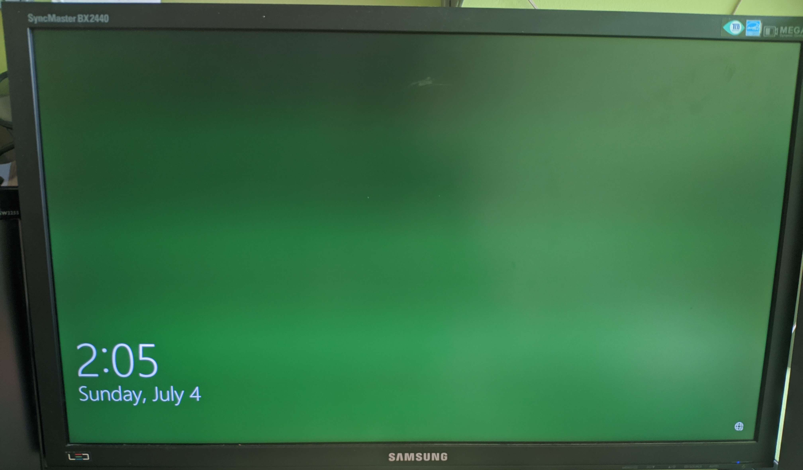

Soo on 07.04 my SSD broke down. But it wasn't an easy case of windows telling me that it went bad and I just got a new one.

## The error
I was using Windows just as any other day, and while leaving it to go eat, it broke. What I got back for was a normal Win logon screen but the background was just green (my accent color in windows).



This could not be fixed by anything that I tried. I after trying the usual set of Ctrl+Alt+Del or Win+R and Alt+F4. None of these worked or produced any change. Many sites suggested Ctrl+Alt+Del, but this did nothing. A lot of other search results were just stupid as they suggested to open up different settings inside Windows... While not being able to log in. So yeah that avenue didn't result in anything useful.
At this point my assumption was that this was a bad Win update. the night before I wasn't home and we had a momentary power outage. The PC wasn't running at that point but maybe it was doing an update at the time. The only problem in the logic was that I did manage to log into the PC in the morning, before it broke down.
 
Next I tried looking for a way to boot into the Recovery Environment. Again I did run into many sites that told me to use the startup config menu... But as I still couldn't log in that was no use. I did find the restart and interrupt method but it was badly documented as it did not specify at what stage I should restart. Never the less I tried at least 3 different places to interrupt and do the restart cycle at least 5 times. But it still did not enter the WinRE. 
Next I found an old Win Install USB and tried to use that to get into the Recovery still hoping to get windows to do a self check or at least reset to before the assumed mangled update. I grew even more concerned when the installer reported that it did not find a windows installation? 

After a bit of searching I did find that there is a separate image for the repair tools. This USB is different from the installer. This new USB did recognize the installation and showed me the restore points that I had. It showed 3 restore points but none of them were from a win update, and the last one was from that day so there was no update that got disrupted. I still tried restoring the last one (It was from a new Unity install I did that day), while I didn't think installing unity could mess up my system this bad it was worth a try. Well it failed with a not too descriptive error. So next I tried the remove update feature but that failed as well with a similar "couldn't remove last update". 

At this point I was ready to bite the bullet and do a full reinstall of windows, as I have already wasted most of the day. So next comes out the Linux live USB to move the small amount of data that I had on the drive to a secondary HDD and do the reinstall. Linux booted up nicely and I started copying files. But it did show a few errors while doing it. Again a non descriptive "Input/Output error while copying", not too useful. But none of the critical files showed this problem so I was happy. But to make sure and to see if the SSD was alright I did search for something in Linux that can give me the drive health info. And this is where I realized the worst.


As the image shows:
```
SMART overall-health self-assessment test result: FAILED
media has been placed in read only mode
```
So this meant that my M.2 SSD was dead. So my whole plan shifter fast, as I needed to look find a new SSD and think up some thing to do in the mean time.

### The result
In the end I installed Linux mint on my spare old SSD and the next day switched to Manjaro as friends told me it was better. So far the experience is not tooo bad, but not a "suitable replacement" as it was advertised on the site 😅

In the end I did end up getting a Samsung 890 Pro 500gb as the replacement and when it gets here I will be going back to Win.

## TL;DR
Windows and Linux forget to mention during boot-up that your main drive is DEAD.